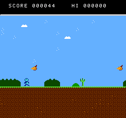

# nurst

A NES emulator written in Rust, with a demo game to try it on.



## Quick start

```bash
cargo build --release
cargo run --release -- demo/nurstrunner.nes
```

That boots **Nurst Runner**, the demo game in `demo/` — jump the cacti, duck
nothing, and do not jump into the birds.

| Key | Action | Key | Action |
| --- | --- | --- | --- |
| Arrows / WASD | D-pad | `Z` / `X` | B / A |
| `Enter` | Start | `Right Shift` | Select |
| `P` | Pause | `R` | Reset |
| `Tab` (hold) | Fast forward | `F12` | Screenshot |
| `Esc` | Quit | | |

## Running other games

Any iNES file on a supported mapper works:

```bash
cargo run --release -- path/to/game.nes --scale 4
```

`tools/fetch_roms.sh` downloads a set of freely redistributable homebrew games
(from the [retrobrews](https://github.com/retrobrews/nes-games) collection) and
the standard nesdev test ROMs into `roms/`. Nothing commercial is fetched or
included.

```bash
./tools/fetch_roms.sh
cargo run --release -- roms/games/sir-ababol-remastered.nes
```

## What is implemented

- **CPU** — all 256 opcodes, official and unofficial, with page-crossing and
  branch cycle penalties, NMI/IRQ/BRK and the `JMP ($xxFF)` page-wrap bug.
- **PPU** — dot-by-dot rendering with the real loopy `v`/`t`/`x` scroll
  registers, background shift registers, 8-sprite-per-line evaluation, 8x16
  sprites, sprite 0 hit, sprite overflow, palette mirroring, greyscale and
  colour emphasis, and the odd-frame short scanline.
- **APU** — two pulse channels with sweep, triangle, noise and DMC, the
  four/five-step frame counter, the hardware's non-linear mixer, and a
  high/low-pass output filter feeding SDL2 audio.
- **Mappers** — 0 (NROM), 1 (MMC1), 2 (UxROM), 3 (CNROM), 4 (MMC3, including
  the A12-clocked scanline IRQ), 7 (AxROM) and 66 (GxROM).
- **Rest of the machine** — OAM DMA with its cycle stall, DMC sample fetches,
  two controllers, open-bus reads, CHR RAM, and all four nametable mirroring
  modes.

## Command line

```
nurst <rom.nes> [OPTIONS]

  --scale <n>          Window scale factor (default 3)
  --mute               Disable audio output
  --headless           Run without a window; useful with --frames
  --frames <n>         Stop after n frames
  --screenshot <path>  Write a PNG of the final frame
  --input <script>     Scripted pad input, e.g. 10:start;12:;90:a;92:
  --trace <path>       Write a nestest-style CPU trace
  --trace-start <hex>  Force the program counter before tracing (e.g. C000)
  --trace-lines <n>    How many instructions to trace (default 10000)
```

## The demo game

`demo/nurstrunner.nes` is built from source in this repository, so there is no
ROM of unknown provenance anywhere in the tree:

```bash
python3 tools/build_rom.py
```

- `demo/runner.asm` — the game, in 6502 assembly
- `tools/asm6502.py` — a small two-pass 6502 assembler
- `tools/tiles.py` — the tile and sprite art, as ASCII pixel maps
- `tools/build_rom.py` — generates the background map, the APU note table and
  the music patterns, assembles everything and writes the iNES file

It leans on the parts of the machine that are easy to get subtly wrong: a
sprite 0 hit splits the screen so the status bar stays fixed while the
playfield scrolls horizontally across both nametables, sprites are shipped by
OAM DMA every frame, and all four APU tone channels are in use.

## Testing

See [TESTING.md](TESTING.md). Short version:

```bash
cargo test --release
```

## Structure

```
src/
├── lib.rs           # the Nes type, wrapping the whole machine
├── main.rs          # CLI
├── frontend.rs      # SDL2 window, keyboard and audio
├── trace.rs         # nestest-style CPU trace output
├── bus.rs           # CPU address space, and the PPU/APU clock
├── rom.rs           # iNES parsing
├── input.rs         # controllers
├── png.rs           # screenshot encoder
├── cpu/             # 6502: decode table, addressing modes, execution
├── ppu/             # 2C02: dot renderer and the NES palette
├── apu/             # 2A03: the five sound channels and the mixer
└── mapper/          # cartridge boards
```
